# 🗄️ MeuPet Database Physical Model

## **Database Physical Model - Mermaid ERD**

```mermaid
erDiagram
    USER {
        int id PK "PRIMARY KEY AUTO_INCREMENT"
        varchar(255) email UK "UNIQUE NOT NULL"
        varchar(255) passwordHash "NOT NULL, SELECT=FALSE"
        varchar(255) fullName "NOT NULL"
        varchar(20) phone "NULLABLE"
        varchar(50) crmv UK "UNIQUE, NULLABLE"
        varchar(100) specialty "NULLABLE"
        json roles "NOT NULL, DEFAULT '[]'"
        boolean isActive "DEFAULT TRUE"
        timestamp createdAt "DEFAULT CURRENT_TIMESTAMP"
        timestamp updatedAt "DEFAULT CURRENT_TIMESTAMP ON UPDATE CURRENT_TIMESTAMP"
    }

    TUTOR {
        int id PK "PRIMARY KEY AUTO_INCREMENT"
        varchar(100) name "NOT NULL"
        varchar(20) telephone "NULLABLE"
        varchar(100) email UK "UNIQUE NOT NULL"
        varchar(14) cpf UK "UNIQUE NOT NULL"
        varchar(255) address "NULLABLE"
        timestamp createdAt "DEFAULT CURRENT_TIMESTAMP"
        timestamp updatedAt "DEFAULT CURRENT_TIMESTAMP ON UPDATE CURRENT_TIMESTAMP"
    }

    ANIMAL {
        int id PK "PRIMARY KEY AUTO_INCREMENT"
        varchar(100) name "NOT NULL"
        varchar(50) species "NOT NULL"
        varchar(50) breed "NOT NULL"
        date birthDate "NOT NULL"
        decimal(5,2) weight "NULLABLE, PRECISION(5,2)"
        varchar(10) gender "NULLABLE"
        int tutorId FK "NOT NULL, FOREIGN KEY"
        timestamp createdAt "DEFAULT CURRENT_TIMESTAMP"
        timestamp updatedAt "DEFAULT CURRENT_TIMESTAMP ON UPDATE CURRENT_TIMESTAMP"
    }

    SCHEDULE {
        int id PK "PRIMARY KEY AUTO_INCREMENT"
        datetime dateHour "NOT NULL"
        text reason "NOT NULL"
        varchar(50) status "DEFAULT 'Agendada'"
        int animalId FK "NOT NULL, FOREIGN KEY"
        int veterinarianId FK "NOT NULL, FOREIGN KEY"
        timestamp createdAt "DEFAULT CURRENT_TIMESTAMP"
        timestamp updatedAt "DEFAULT CURRENT_TIMESTAMP ON UPDATE CURRENT_TIMESTAMP"
    }

    MEDICAL_RECORD {
        int id PK "PRIMARY KEY AUTO_INCREMENT"
        int scheduleId FK UK "UNIQUE NOT NULL, FOREIGN KEY"
        text anamnesis "NOT NULL"
        text diagnosis "NOT NULL"
        text treatment "NOT NULL"
        int veterinarianId FK "NOT NULL, FOREIGN KEY"
        timestamp dateMedicalRecord "DEFAULT CURRENT_TIMESTAMP"
        timestamp createdAt "DEFAULT CURRENT_TIMESTAMP"
        timestamp updatedAt "DEFAULT CURRENT_TIMESTAMP ON UPDATE CURRENT_TIMESTAMP"
    }

    PROCEDURE {
        int id PK "PRIMARY KEY AUTO_INCREMENT"
        varchar(100) name "NOT NULL"
        text observations "NULLABLE"
        decimal(10,2) cost "NULLABLE, PRECISION(10,2)"
        int medicalRecordId FK "NOT NULL, FOREIGN KEY"
        timestamp createdAt "DEFAULT CURRENT_TIMESTAMP"
        timestamp updatedAt "DEFAULT CURRENT_TIMESTAMP ON UPDATE CURRENT_TIMESTAMP"
    }

    EXAM {
        int id PK "PRIMARY KEY AUTO_INCREMENT"
        varchar(100) name "NOT NULL"
        date requestDate "NOT NULL"
        date resultDate "NULLABLE"
        varchar(50) status "DEFAULT 'Solicitado'"
        text result "NULLABLE"
        varchar(255) resultUrlUrl "NULLABLE"
        int animalId FK "NOT NULL, FOREIGN KEY"
        int veterinarianId FK "NOT NULL, FOREIGN KEY"
        timestamp createdAt "DEFAULT CURRENT_TIMESTAMP"
        timestamp updatedAt "DEFAULT CURRENT_TIMESTAMP ON UPDATE CURRENT_TIMESTAMP"
    }

    %% Relationships
    TUTOR ||--o{ ANIMAL : "owns (tutorId)"
    USER ||--o{ SCHEDULE : "attends_as_veterinarian (veterinarianId)"
    ANIMAL ||--o{ SCHEDULE : "has_appointments (animalId)"
    SCHEDULE ||--|| MEDICAL_RECORD : "generates (scheduleId)"
    USER ||--o{ MEDICAL_RECORD : "creates (veterinarianId)"
    MEDICAL_RECORD ||--o{ PROCEDURE : "includes (medicalRecordId)"
    ANIMAL ||--o{ EXAM : "undergoes (animalId)"
    USER ||--o{ EXAM : "requests (veterinarianId)"
```

---

## **📋 Table Specifications**

### **🔑 Primary Keys & Constraints**

| Table | Primary Key | Foreign Keys | Unique Constraints |
|-------|-------------|--------------|-------------------|
| USER | id | - | email, crmv |
| TUTOR | id | - | email, cpf |
| ANIMAL | id | tutorId → TUTOR(id) | - |
| SCHEDULE | id | animalId → ANIMAL(id)<br>veterinarianId → USER(id) | - |
| MEDICAL_RECORD | id | scheduleId → SCHEDULE(id)<br>veterinarianId → USER(id) | scheduleId |
| PROCEDURE | id | medicalRecordId → MEDICAL_RECORD(id) | - |
| EXAM | id | animalId → ANIMAL(id)<br>veterinarianId → USER(id) | - |

---

### **🔗 Relationship Details**

```mermaid
graph TD
    A[TUTOR] -->|1:N| B[ANIMAL]
    B -->|1:N| C[SCHEDULE]
    D[USER] -->|1:N| C
    C -->|1:1| E[MEDICAL_RECORD]
    D -->|1:N| E
    E -->|1:N| F[PROCEDURE]
    B -->|1:N| G[EXAM]
    D -->|1:N| G
    
    A1[TUTOR<br/>• 1 tutor can own many animals<br/>• CASCADE DELETE]
    B1[ANIMAL<br/>• 1 animal belongs to 1 tutor<br/>• 1 animal can have many schedules<br/>• 1 animal can have many exams]
    C1[SCHEDULE<br/>• 1 schedule belongs to 1 animal<br/>• 1 schedule is attended by 1 veterinarian<br/>• 1 schedule generates 1 medical record]
    D1[USER<br/>• 1 user can attend many schedules<br/>• 1 user can create many medical records<br/>• 1 user can request many exams]
    E1[MEDICAL_RECORD<br/>• 1 medical record belongs to 1 schedule<br/>• 1 medical record can have many procedures]
    F1[PROCEDURE<br/>• 1 procedure belongs to 1 medical record]
    G1[EXAM<br/>• 1 exam belongs to 1 animal<br/>• 1 exam is requested by 1 veterinarian]
```



---

### **🏗️ Database Indexes Recommended**

```sql
-- Performance Indexes
CREATE INDEX idx_animal_tutor ON ANIMAL(tutorId);
CREATE INDEX idx_schedule_animal ON SCHEDULE(animalId);
CREATE INDEX idx_schedule_veterinarian ON SCHEDULE(veterinarianId);
CREATE INDEX idx_schedule_date ON SCHEDULE(dateHour);
CREATE INDEX idx_medical_record_schedule ON MEDICAL_RECORD(scheduleId);
CREATE INDEX idx_medical_record_veterinarian ON MEDICAL_RECORD(veterinarianId);
CREATE INDEX idx_procedure_medical_record ON PROCEDURE(medicalRecordId);
CREATE INDEX idx_exam_animal ON EXAM(animalId);
CREATE INDEX idx_exam_veterinarian ON EXAM(veterinarianId);
CREATE INDEX idx_exam_request_date ON EXAM(requestDate);

-- Search Indexes
CREATE INDEX idx_user_email ON USER(email);
CREATE INDEX idx_tutor_email ON TUTOR(email);
CREATE INDEX idx_tutor_cpf ON TUTOR(cpf);
CREATE INDEX idx_user_crmv ON USER(crmv);
CREATE INDEX idx_animal_name ON ANIMAL(name);
```

---

### **🛡️ Database Constraints**

```sql
-- Foreign Key Constraints with Cascade Rules
ALTER TABLE ANIMAL 
ADD CONSTRAINT fk_animal_tutor 
FOREIGN KEY (tutorId) REFERENCES TUTOR(id) ON DELETE CASCADE;

ALTER TABLE SCHEDULE 
ADD CONSTRAINT fk_schedule_animal 
FOREIGN KEY (animalId) REFERENCES ANIMAL(id) ON DELETE CASCADE;

ALTER TABLE SCHEDULE 
ADD CONSTRAINT fk_schedule_veterinarian 
FOREIGN KEY (veterinarianId) REFERENCES USER(id) ON DELETE RESTRICT;

ALTER TABLE MEDICAL_RECORD 
ADD CONSTRAINT fk_medical_record_schedule 
FOREIGN KEY (scheduleId) REFERENCES SCHEDULE(id) ON DELETE CASCADE;

ALTER TABLE MEDICAL_RECORD 
ADD CONSTRAINT fk_medical_record_veterinarian 
FOREIGN KEY (veterinarianId) REFERENCES USER(id) ON DELETE RESTRICT;

ALTER TABLE PROCEDURE 
ADD CONSTRAINT fk_procedure_medical_record 
FOREIGN KEY (medicalRecordId) REFERENCES MEDICAL_RECORD(id) ON DELETE CASCADE;

ALTER TABLE EXAM 
ADD CONSTRAINT fk_exam_animal 
FOREIGN KEY (animalId) REFERENCES ANIMAL(id) ON DELETE CASCADE;

ALTER TABLE EXAM 
ADD CONSTRAINT fk_exam_veterinarian 
FOREIGN KEY (veterinarianId) REFERENCES USER(id) ON DELETE RESTRICT;

-- Check Constraints
ALTER TABLE USER 
ADD CONSTRAINT chk_user_roles 
CHECK (JSON_VALID(roles));

ALTER TABLE ANIMAL 
ADD CONSTRAINT chk_animal_weight 
CHECK (weight > 0);

ALTER TABLE PROCEDURE 
ADD CONSTRAINT chk_procedure_cost 
CHECK (cost >= 0);

ALTER TABLE SCHEDULE 
ADD CONSTRAINT chk_schedule_status 
CHECK (status IN ('Agendada', 'Confirmada', 'Em Andamento', 'Concluída', 'Cancelada'));

ALTER TABLE EXAM 
ADD CONSTRAINT chk_exam_status 
CHECK (status IN ('Solicitado', 'Em Andamento', 'Finalizado', 'Cancelado'));
```

---

### **📊 Data Types & Storage Specifications**

| Field Type | MySQL Type | Size | Notes |
|------------|------------|------|-------|
| id (PK) | INT | 4 bytes | AUTO_INCREMENT |
| email | VARCHAR(255) | Variable | UTF8MB4 collation |
| password | VARCHAR(255) | 60 chars | bcrypt hash |
| phone | VARCHAR(20) | Variable | International format |
| cpf | VARCHAR(14) | 14 chars | Format: XXX.XXX.XXX-XX |
| crmv | VARCHAR(50) | Variable | State + number |
| roles | JSON | Variable | Array of role strings |
| weight | DECIMAL(5,2) | 5 digits | Max 999.99 kg |
| cost | DECIMAL(10,2) | 10 digits | Max 99999999.99 |
| datetime | DATETIME | 8 bytes | MySQL DATETIME |
| date | DATE | 3 bytes | MySQL DATE |
| text | TEXT | 65535 chars | UTF8MB4 |
| boolean | TINYINT(1) | 1 byte | 0/1 values |

---

### **⚡ Performance Considerations**

#### **Query Optimization Patterns**
```sql
-- Efficient patient history query
SELECT a.name, t.name as tutor_name, 
       s.dateHour, mr.diagnosis, mr.treatment
FROM ANIMAL a
JOIN TUTOR t ON a.tutorId = t.id
LEFT JOIN SCHEDULE s ON s.animalId = a.id
LEFT JOIN MEDICAL_RECORD mr ON mr.scheduleId = s.id
WHERE a.id = ? ORDER BY s.dateHour DESC;

-- Veterinarian workload query
SELECT u.fullName, COUNT(s.id) as appointments_today
FROM USER u
LEFT JOIN SCHEDULE s ON s.veterinarianId = u.id 
WHERE DATE(s.dateHour) = CURDATE()
AND JSON_CONTAINS(u.roles, '"veterinarian"')
GROUP BY u.id;
```

#### **Storage Optimization**
- **Partitioning**: Consider partitioning SCHEDULE and MEDICAL_RECORD by date
- **Archiving**: Move old records (>2 years) to archive tables
- **Compression**: Enable row compression for TEXT fields
- **Indexing**: Use composite indexes for common query patterns

---

### **🔐 Security Specifications**

#### **Data Protection**
- **Passwords**: bcrypt hash with salt rounds = 10
- **PII Encryption**: Consider encrypting CPF and phone numbers
- **Audit Trail**: Add created_by, updated_by fields for compliance
- **Soft Deletes**: Implement soft delete for critical business data

#### **Access Control**
- **Row-Level Security**: Veterinarians can only access their assigned patients
- **Column-Level Security**: Restrict password hash access
- **Connection Security**: SSL/TLS for database connections
- **Backup Encryption**: Encrypted database backups

---

This physical model represents the complete database structure for the MeuPet veterinary management system, including all constraints, relationships, and performance optimizations needed for production deployment.